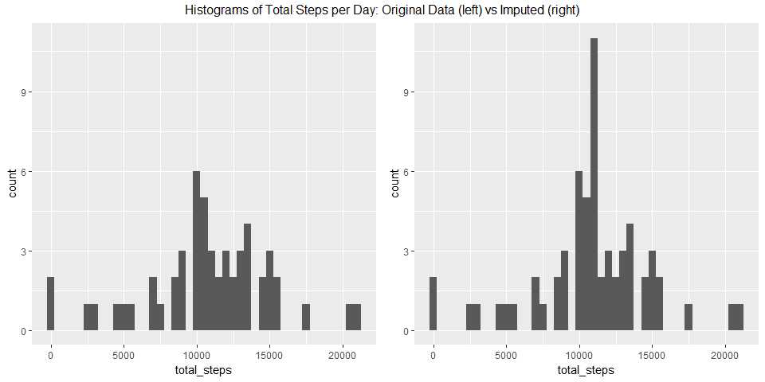

###Assignment:
Create a markdown document walking through the exploratory data analysis of the dataset


###Package dependencies:

```r
library(ggplot2)
library(dplyr)
library(lubridate)
library(gridExtra)
```

###Loading and preprocessing the data:  
  
The following chunk of code checks to see if the data for this project has already been downloaded, and proceeds to download and unzip the file **only if** it is not already present in the working directory.

```r
if(!file.exists("./activity.csv")){
      #proceeds if absent with download, and unzip
      temp<-tempfile("./temp.zip")
      fileUrl<-"https://d396qusza40orc.cloudfront.net/repdata%2Fdata%2Factivity.zip"
      download.file(fileUrl,destfile = "./temp.zip")
      unzip("./temp.zip")
      unlink("./temp.zip")
} 
```


Now we will read the CSV file into R as a data frame. The second line of code converts the dates into the appropriate variable class.

```r
act<-read.csv("activity.csv", header = TRUE)
act$date<-ymd(act$date) #changing to date class
```

Now let's dive into the analysis and start to answer some questions with this data.  
  
###What is the mean total number of steps taken per day?  
  
Utilizing 'dplyr' package, we will create a summary table of the mean, median, and total number of steps broken down by day 

```r
daily<- act %>%  #getting steps per day
      group_by(date) %>%
      summarize(count = n(),
                mean = mean(steps, na.rm = T),
                median = median(steps, na.rm = T),
                total_steps = sum(steps)) %>%
      print(daily, n=61)
```

```
## # A tibble: 61 x 5
##          date count       mean median total_steps
##        <date> <int>      <dbl>  <dbl>       <int>
##  1 2012-10-01   288        NaN     NA          NA
##  2 2012-10-02   288  0.4375000      0         126
##  3 2012-10-03   288 39.4166667      0       11352
##  4 2012-10-04   288 42.0694444      0       12116
##  5 2012-10-05   288 46.1597222      0       13294
##  6 2012-10-06   288 53.5416667      0       15420
##  7 2012-10-07   288 38.2465278      0       11015
##  8 2012-10-08   288        NaN     NA          NA
##  9 2012-10-09   288 44.4826389      0       12811
## 10 2012-10-10   288 34.3750000      0        9900
## 11 2012-10-11   288 35.7777778      0       10304
## 12 2012-10-12   288 60.3541667      0       17382
## 13 2012-10-13   288 43.1458333      0       12426
## 14 2012-10-14   288 52.4236111      0       15098
## 15 2012-10-15   288 35.2048611      0       10139
## 16 2012-10-16   288 52.3750000      0       15084
## 17 2012-10-17   288 46.7083333      0       13452
## 18 2012-10-18   288 34.9166667      0       10056
## 19 2012-10-19   288 41.0729167      0       11829
## 20 2012-10-20   288 36.0937500      0       10395
## 21 2012-10-21   288 30.6284722      0        8821
## 22 2012-10-22   288 46.7361111      0       13460
## 23 2012-10-23   288 30.9652778      0        8918
## 24 2012-10-24   288 29.0104167      0        8355
## 25 2012-10-25   288  8.6527778      0        2492
## 26 2012-10-26   288 23.5347222      0        6778
## 27 2012-10-27   288 35.1354167      0       10119
## 28 2012-10-28   288 39.7847222      0       11458
## 29 2012-10-29   288 17.4236111      0        5018
## 30 2012-10-30   288 34.0937500      0        9819
## 31 2012-10-31   288 53.5208333      0       15414
## 32 2012-11-01   288        NaN     NA          NA
## 33 2012-11-02   288 36.8055556      0       10600
## 34 2012-11-03   288 36.7048611      0       10571
## 35 2012-11-04   288        NaN     NA          NA
## 36 2012-11-05   288 36.2465278      0       10439
## 37 2012-11-06   288 28.9375000      0        8334
## 38 2012-11-07   288 44.7326389      0       12883
## 39 2012-11-08   288 11.1770833      0        3219
## 40 2012-11-09   288        NaN     NA          NA
## 41 2012-11-10   288        NaN     NA          NA
## 42 2012-11-11   288 43.7777778      0       12608
## 43 2012-11-12   288 37.3784722      0       10765
## 44 2012-11-13   288 25.4722222      0        7336
## 45 2012-11-14   288        NaN     NA          NA
## 46 2012-11-15   288  0.1423611      0          41
## 47 2012-11-16   288 18.8923611      0        5441
## 48 2012-11-17   288 49.7881944      0       14339
## 49 2012-11-18   288 52.4652778      0       15110
## 50 2012-11-19   288 30.6979167      0        8841
## 51 2012-11-20   288 15.5277778      0        4472
## 52 2012-11-21   288 44.3993056      0       12787
## 53 2012-11-22   288 70.9270833      0       20427
## 54 2012-11-23   288 73.5902778      0       21194
## 55 2012-11-24   288 50.2708333      0       14478
## 56 2012-11-25   288 41.0902778      0       11834
## 57 2012-11-26   288 38.7569444      0       11162
## 58 2012-11-27   288 47.3819444      0       13646
## 59 2012-11-28   288 35.3576389      0       10183
## 60 2012-11-29   288 24.4687500      0        7047
## 61 2012-11-30   288        NaN     NA          NA
```

```r
summary(daily$total_steps)
```

```
##    Min. 1st Qu.  Median    Mean 3rd Qu.    Max.    NA's 
##      41    8841   10765   10766   13294   21194       8
```
What we can see from the above table is that 8 days are completely missing (perhaps subject forgot to charge or wear the fitbit). 
  
  
Let's create a histogram of the total number of steps per day  

```r
h<-ggplot(daily, aes(total_steps))
h+geom_histogram(binwidth = 500)
```

<!-- -->
Hmm, there are only 61 days in the dataset so that looks OK (perhaps a little sparse, but somewhat resembles a normal distrubtion in overall shape).  

The following code creates a graph that displays the total steps per day for each day in the dataset:

```r
g<-ggplot(daily, aes(date, total_steps))
g+geom_bar(stat="identity")
```

<!-- -->
[*note: this is not a histogram*](https://www.forbes.com/sites/naomirobbins/2012/01/04/a-histogram-is-not-a-bar-chart/)  
  
###What is the average daily activity pattern?
  
To show the average steps taken for each interval, we'll make a new summary table grouping by interval.

```r
interval<- act %>%
      group_by(interval = interval) %>%
      summarize(count = n(),
                AverageSteps = mean(steps, na.rm =T)) %>%
      print()
```

```
## # A tibble: 288 x 3
##    interval count AverageSteps
##       <int> <int>        <dbl>
##  1        0    61    1.7169811
##  2        5    61    0.3396226
##  3       10    61    0.1320755
##  4       15    61    0.1509434
##  5       20    61    0.0754717
##  6       25    61    2.0943396
##  7       30    61    0.5283019
##  8       35    61    0.8679245
##  9       40    61    0.0000000
## 10       45    61    1.4716981
## # ... with 278 more rows
```

```r
summary(interval$AverageSteps)
```

```
##    Min. 1st Qu.  Median    Mean 3rd Qu.    Max. 
##   0.000   2.486  34.113  37.383  52.835 206.170
```
We can see from the summary table that the maximum **mean** steps per 5 minute interval is ~206.  Let's see which interval this peak corresponds to.  Using the 'filter' function, I'm selecting all rows (intervals)from the summary dataset where the mean number of steps is greater than 200.

```r
filter(interval, AverageSteps > 200)
```

```
## # A tibble: 1 x 3
##   interval count AverageSteps
##      <int> <int>        <dbl>
## 1      835    61     206.1698
```
We can see that the interval that corresponds to the maximum **mean** steps per 5 minutes is 835, or 8:35-8:40am.  
  
Here is a time-series plot showing the average number of steps shown for each 5 minute interval

```r
t<-ggplot(interval, aes(interval, AverageSteps))
t+geom_line()
```

<!-- -->
One thing to note:  the interval is actually the concatenated hour and minute of the start of a 5min interval, ie 1000 = 10:00am.  This is why the x-axis goes to 2400 instead of the 1440 minutes in 24 hours.
  
  
###Imputing missing values
How many missing values do we have?

```r
summary(act$steps)
```

```
##    Min. 1st Qu.  Median    Mean 3rd Qu.    Max.    NA's 
##    0.00    0.00    0.00   37.38   12.00  806.00    2304
```

Wow, there are quite a few missing values - over 10%!  To try get a better picture of the average daily activity, I'd like to impute the average value for that interval.  We also notice that the number of complete missing days (8), times the number of 5min intervals per day (288) = 2304, the number of missing values in the dataset.  Therefore, there are no days with a few missing values, only entire days missing.
  
I'm going to first duplicate the dataset, so we can compare the imputed dataset to the original.  
Then I'll use a 'for loop' to replace the NAs with the average value for that interval.  
Finally, I'll compare the 'steps' variable for the imputed and original datasets.

```r
actimp<-act 

for (i in 1:nrow(actimp)) {
      if (is.na(actimp$steps[i])){
            int<-actimp$interval[i] 
            imp<-interval$AverageSteps[interval == int] 
            actimp$steps[i]<-round(imp, digits=0) #rounded off to whole steps
      }
}
summary(actimp$steps)
```

```
##    Min. 1st Qu.  Median    Mean 3rd Qu.    Max. 
##    0.00    0.00    0.00   37.38   27.00  806.00
```

```r
summary(act$steps)
```

```
##    Min. 1st Qu.  Median    Mean 3rd Qu.    Max.    NA's 
##    0.00    0.00    0.00   37.38   12.00  806.00    2304
```
OK! Confirmation that there are no longer any NAs in the new dataset, and it shows that both the mean and median values have not changed.  One possible downside of imputing the values this way is that each of the 8 missing days-worth of data is imputed with exactly the same values.  A better way to approach this may have been to use the average values for the corresponding day of the week.  
  

Before we check out some plots of this new dataset, we'll recreate the daily activity summary of the new dataset with imputed values.

```r
dailyimp<- actimp %>% 
      group_by(date) %>%
      summarize(count = n(),
                mean = mean(steps, na.rm = T),
                median = median(steps, na.rm = T),
                total_steps = sum(steps)) %>%
      print(dailyimp, n=61)
```

```
## # A tibble: 61 x 5
##          date count       mean median total_steps
##        <date> <int>      <dbl>  <dbl>       <dbl>
##  1 2012-10-01   288 37.3680556   34.5       10762
##  2 2012-10-02   288  0.4375000    0.0         126
##  3 2012-10-03   288 39.4166667    0.0       11352
##  4 2012-10-04   288 42.0694444    0.0       12116
##  5 2012-10-05   288 46.1597222    0.0       13294
##  6 2012-10-06   288 53.5416667    0.0       15420
##  7 2012-10-07   288 38.2465278    0.0       11015
##  8 2012-10-08   288 37.3680556   34.5       10762
##  9 2012-10-09   288 44.4826389    0.0       12811
## 10 2012-10-10   288 34.3750000    0.0        9900
## 11 2012-10-11   288 35.7777778    0.0       10304
## 12 2012-10-12   288 60.3541667    0.0       17382
## 13 2012-10-13   288 43.1458333    0.0       12426
## 14 2012-10-14   288 52.4236111    0.0       15098
## 15 2012-10-15   288 35.2048611    0.0       10139
## 16 2012-10-16   288 52.3750000    0.0       15084
## 17 2012-10-17   288 46.7083333    0.0       13452
## 18 2012-10-18   288 34.9166667    0.0       10056
## 19 2012-10-19   288 41.0729167    0.0       11829
## 20 2012-10-20   288 36.0937500    0.0       10395
## 21 2012-10-21   288 30.6284722    0.0        8821
## 22 2012-10-22   288 46.7361111    0.0       13460
## 23 2012-10-23   288 30.9652778    0.0        8918
## 24 2012-10-24   288 29.0104167    0.0        8355
## 25 2012-10-25   288  8.6527778    0.0        2492
## 26 2012-10-26   288 23.5347222    0.0        6778
## 27 2012-10-27   288 35.1354167    0.0       10119
## 28 2012-10-28   288 39.7847222    0.0       11458
## 29 2012-10-29   288 17.4236111    0.0        5018
## 30 2012-10-30   288 34.0937500    0.0        9819
## 31 2012-10-31   288 53.5208333    0.0       15414
## 32 2012-11-01   288 37.3680556   34.5       10762
## 33 2012-11-02   288 36.8055556    0.0       10600
## 34 2012-11-03   288 36.7048611    0.0       10571
## 35 2012-11-04   288 37.3680556   34.5       10762
## 36 2012-11-05   288 36.2465278    0.0       10439
## 37 2012-11-06   288 28.9375000    0.0        8334
## 38 2012-11-07   288 44.7326389    0.0       12883
## 39 2012-11-08   288 11.1770833    0.0        3219
## 40 2012-11-09   288 37.3680556   34.5       10762
## 41 2012-11-10   288 37.3680556   34.5       10762
## 42 2012-11-11   288 43.7777778    0.0       12608
## 43 2012-11-12   288 37.3784722    0.0       10765
## 44 2012-11-13   288 25.4722222    0.0        7336
## 45 2012-11-14   288 37.3680556   34.5       10762
## 46 2012-11-15   288  0.1423611    0.0          41
## 47 2012-11-16   288 18.8923611    0.0        5441
## 48 2012-11-17   288 49.7881944    0.0       14339
## 49 2012-11-18   288 52.4652778    0.0       15110
## 50 2012-11-19   288 30.6979167    0.0        8841
## 51 2012-11-20   288 15.5277778    0.0        4472
## 52 2012-11-21   288 44.3993056    0.0       12787
## 53 2012-11-22   288 70.9270833    0.0       20427
## 54 2012-11-23   288 73.5902778    0.0       21194
## 55 2012-11-24   288 50.2708333    0.0       14478
## 56 2012-11-25   288 41.0902778    0.0       11834
## 57 2012-11-26   288 38.7569444    0.0       11162
## 58 2012-11-27   288 47.3819444    0.0       13646
## 59 2012-11-28   288 35.3576389    0.0       10183
## 60 2012-11-29   288 24.4687500    0.0        7047
## 61 2012-11-30   288 37.3680556   34.5       10762
```

```r
summary(dailyimp$total_steps)
```

```
##    Min. 1st Qu.  Median    Mean 3rd Qu.    Max. 
##      41    9819   10762   10766   12811   21194
```

```r
summary(daily$total_steps)
```

```
##    Min. 1st Qu.  Median    Mean 3rd Qu.    Max.    NA's 
##      41    8841   10765   10766   13294   21194       8
```
We see that the mean and median of the **total daily step counts** have not changed (like the ungrouped step counts before and after imputing the missing values).  
  
Let's revist the histogram we made for the original dataset, showing total number of steps per day with the missing values imputed.

```r
require(gridExtra)
orig<-h+geom_histogram(binwidth = 500)+ylim(0,11)
h2<-ggplot(dailyimp, aes(total_steps))
newhisto<-h2+geom_histogram(binwidth = 500)
grid.arrange(orig, newhisto, ncol=2, top="Histograms of Total Steps per Day: Original Data (left) vs Imputed (right)")
```

<!-- -->
So by imputing the missin gvalues with the mean of that interval, we've gone from 3 to 11 days with 10,500-11,000 total steps, with no other changes. 
(A gain of 8!! Since we already noticed all 8 days were imputed with identical values -- using the means of each interval.  This make sense.)  

  
###Are there differences in activity patterns between weekdays and weekends?
First, we'll use the 'wday' function from the lubridate package to identify the day of the week form the date variable.  We'll use that number to create a new variable called 'type.'  Note wday returns a number 1-7 corresponding to the day of the week (starting with 1=Monday).  Then we'll convert that variable into a factor.

```r
for (i in 1:nrow(actimp)) {
      if (wday(actimp$date[i]) > 5){
            actimp$type[i]<- as.character("weekend") 
      }
      else {(actimp$type[i]<- as.character("weekday"))}
}
actimp$type<-as.factor(actimp$type)
str(actimp$type)
```

```
##  Factor w/ 2 levels "weekday","weekend": 1 1 1 1 1 1 1 1 1 1 ...
```
We can confirm with a call to 'str' (structure) that the column 'type' is a factor with two values: 'weekday' or 'weekend'  
  
We'd like to test whether the average daily activity is greater on the weekend, so we'll create  another summary with dplry for the average steps by interval for weekend vs weekday.

```r
weekend<- actimp %>%
      group_by(day = type, interval = interval) %>%
      summarize(count = n(),
                meanSteps = mean(steps),
                totalSteps = sum(steps)) %>%
      print()
```

```
## # A tibble: 576 x 5
## # Groups:   day [?]
##        day interval count  meanSteps totalSteps
##     <fctr>    <int> <int>      <dbl>      <dbl>
##  1 weekday        0    44 2.29545455        101
##  2 weekday        5    44 0.40909091         18
##  3 weekday       10    44 0.15909091          7
##  4 weekday       15    44 0.18181818          8
##  5 weekday       20    44 0.09090909          4
##  6 weekday       25    44 2.75000000        121
##  7 weekday       30    44 0.75000000         33
##  8 weekday       35    44 1.15909091         51
##  9 weekday       40    44 0.00000000          0
## 10 weekday       45    44 1.75000000         77
## # ... with 566 more rows
```
  
Now, to create a plot evaluating the time-series step data we saw before, broken down by weekday vs weekend:  

```r
wkdays<-ggplot(weekend, aes(interval, meanSteps))
wkdays+facet_grid(day~.)+geom_line()+
      labs(title="Weekday vs Weekend activity")
```

<!-- -->
  
Excellent!  As you might expect, there does appear to be a greater amount of activity (on average) on the weekends vs weekdays.  There is a slight decrease in the activity in the morning, from around 5:30-8:00am before the large peak that consistently occurs around 8-9am.  Interestingly, this peak is in the same place on both weekends and weekdays!  There is more activity between about 12:30-4pm on weekends vs weekdays.


```r
weektotal<- weekend %>%
      group_by(day) %>%
      summarize(count = n(),
                AverageSteps = sum(meanSteps)) %>% 
            #this is the sum of the interval means for weekday vs weekend 
      print()
```

```
## # A tibble: 2 x 3
##       day count AverageSteps
##    <fctr> <int>        <dbl>
## 1 weekday   288     10230.73
## 2 weekend   288     12150.12
```
Finally, we see the average total number of steps per day on a weekday vs weekend day.  
  
  
###limitations
One minor problem with this dataset is that interval is treated as a continuous variable (ie, counting in consecutive 5 minute intervals), when instead it represents the concatenated hour and minute of the subsequent 5min interval.  Since there are only 60 minutes in an hour, for every 100 "units" on the x-axis, there are no values from 60-95, creating "gaps" which a line graph (geom line) connects.  


**end of analysis**
